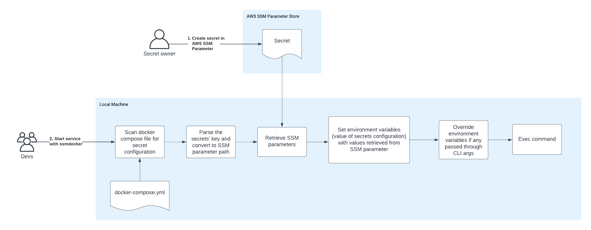

# AWS SSM Parameter for Docker
**This is a prototype**

This is a tool that allows pulling the secrets defined in the docker compose files from AWS SSM Parameter store to be used.

The diagram below describes the process:



## Commands

```shell 
ssmdocker help
```

### Exec

Pull the secrets and execute the command

Example:

```shell
ssmdocker --aws-region "<region>" --aws-profile "<profile>" exec -- docker-compose up -d
```